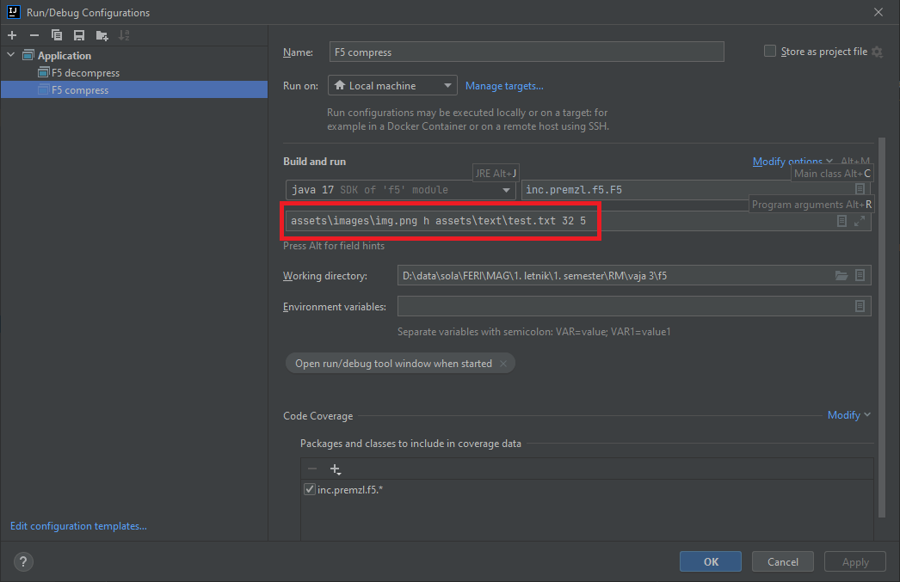

# Installation

## OpenCV

1. Download [the latest OpenCV](https://opencv.org/releases/) release
2. Add a dependency in the Project Structure
3. Add the .dll file

[Video reference](https://www.youtube.com/watch?v=vLf3ZcFotyA&ab_channel=Makeitnow)

## Usage

### Program arguments

#### COMPRESSION

```
    <input image> h <input text> <N> <M> <key>
    
    <input image> - path to the input image
                    (if in assets, path will be assets\images\image.ext)
    h - option for compression
    <input text> - path to the text file
                   (if in assets, path will be assets\text\text.txt)
    <N> - compression threshold
    <M> - number of unique sets
    <key> - key for encryption
```

#### DECOMPRESSION

```
    <compressed binary> e <output file> <N> <M> <key>
    
    <compressed binary> - path to the input binary 
                    (result of compression)
                    (if in assets, path will be assets\images\out.bin)
    e - option for decompression
    <output file> - path, where the output file will be created
    <N> - compression threshold
    <M> - number of unique sets
    <key> - key for encryption
```

### Configuration

Using IntelliJ IDEA, create a new configuration:


